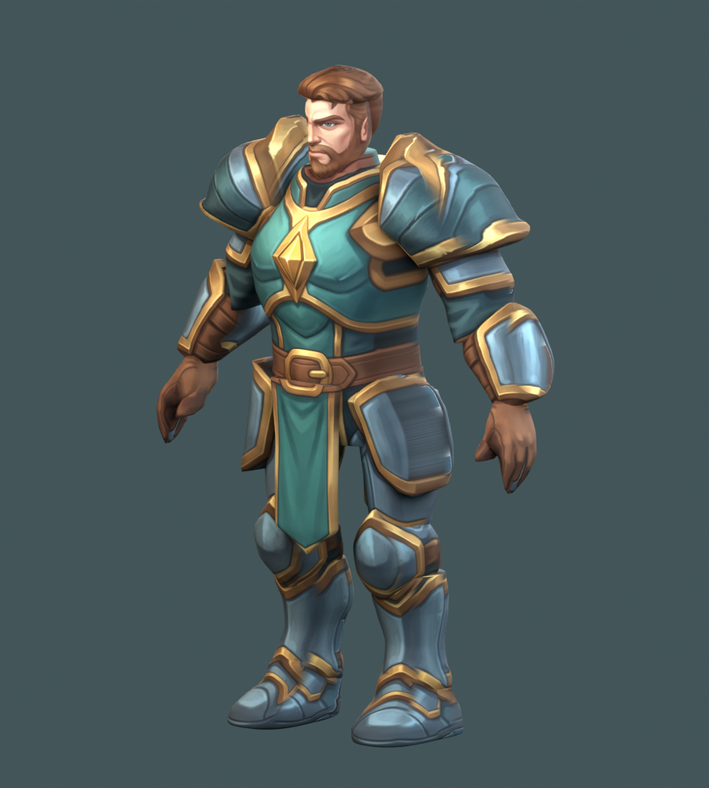
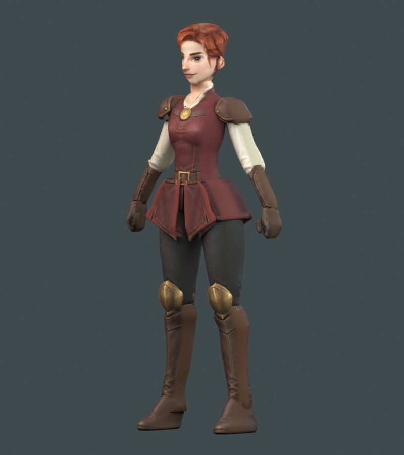
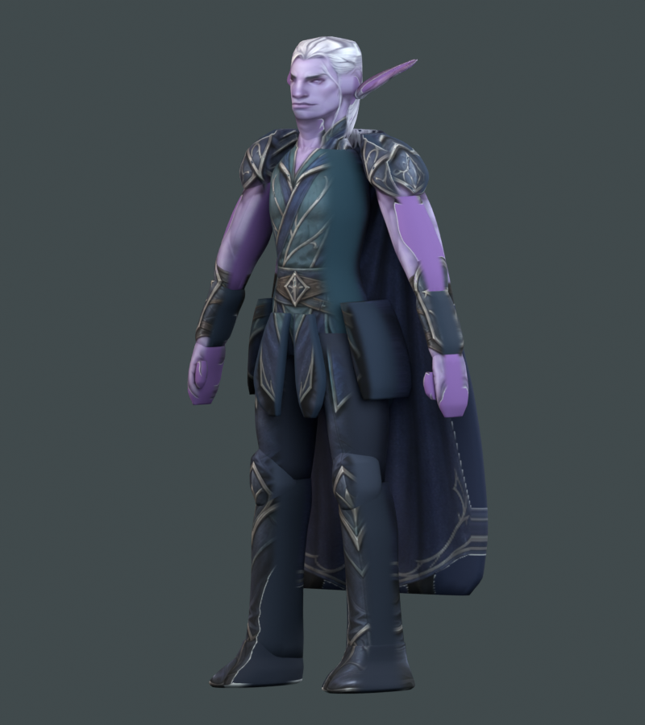
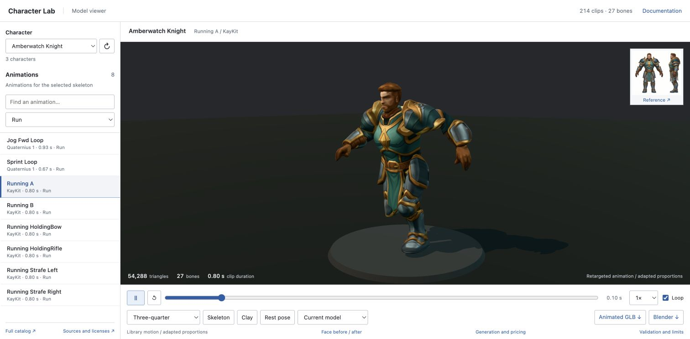
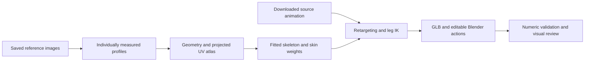
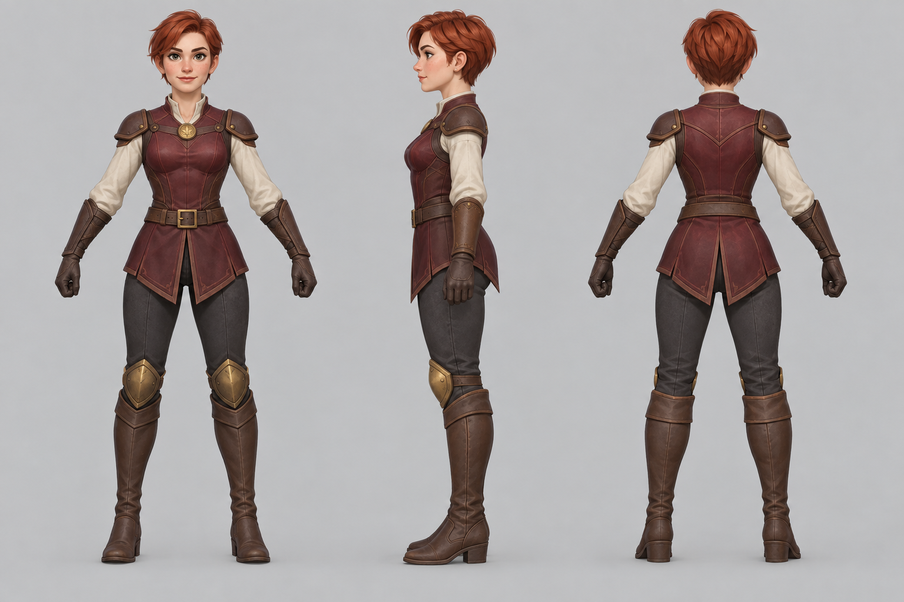
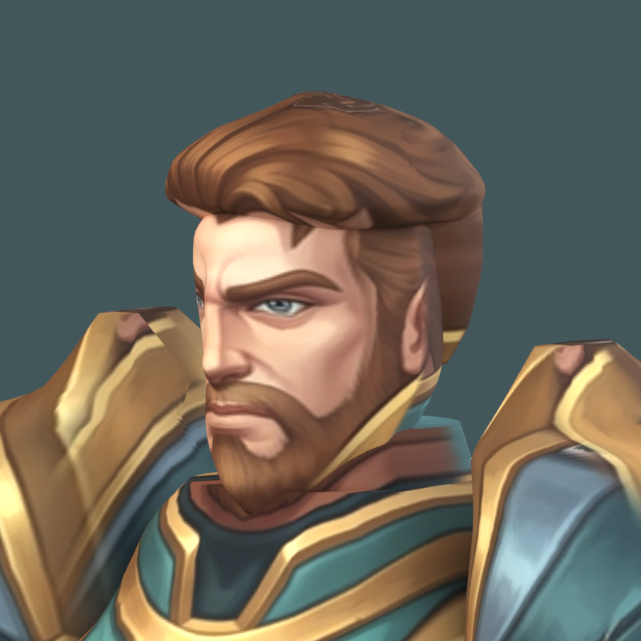
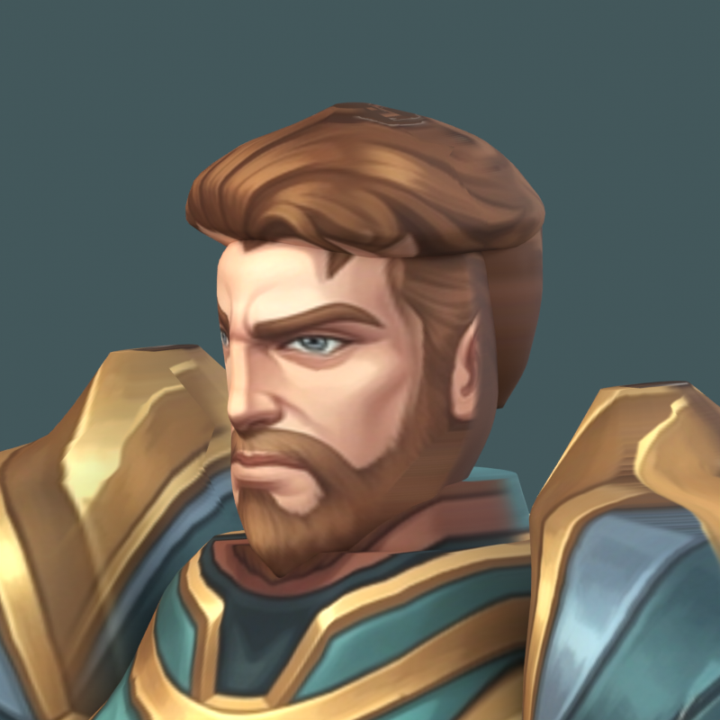

# Character Lab

**Image references → measured geometry → projected textures → fitted skeletons → real animation.**

A standalone, reproducible character modeling experiment with three completed characters, an offline build pipeline, and a small Three.js inspection tool. Each character has its own proportions, texture atlas, 27-joint rig, and 214 retargeted animation clips.

| Amberwatch Knight | Woodland Ranger | Night Elf |
|:---:|:---:|:---:|
|  |  |  |
| 54,288 triangles | 57,584 triangles | 61,188 triangles |
| 27,704 vertices · 27 joints | 29,477 vertices · 27 joints | 31,242 vertices · 27 joints |
| [GLB](assets/knight-animated.glb) · [Blender](assets/knight-animated.blend) | [GLB](assets/ranger-animated.glb) · [Blender](assets/ranger-animated.blend) | [GLB](assets/elf-animated.glb) · [Blender](assets/elf-animated.blend) |

*These are renders of the exported models. The supplied characters are historical examples; new base characters must omit cloaks and protruding equipment, which are modeled separately.*

[How it works](#how-it-works) · [Run the viewer](#run-the-viewer) · [Build offline](#build-offline) · [Add a character](#add-a-character) · [Validation](docs/VALIDATION.md)

**Using a local model, ChatGPT or Gemini?** Follow the [new-agent setup and provider guide](docs/AGENT_START.md). It includes first-run commands, reference import instructions and a ready-to-copy agent task. Coding agents can use your chosen model host; image references can come from any suitable image tool. The included API helper currently connects to OpenAI; Gemini and local image outputs use the documented file import workflow.

## What is included

- Three independently calibrated characters with embedded textures, skinning and editable Blender actions.
- **214 real source animations per character**, including 32 idle clips and 8 runs, retargeted from the free Quaternius and KayKit packs.
- Target-specific motion-only GLBs, original downloaded archives and license files.
- A compact viewer with model selection, animation search, playback controls, camera presets, skeleton and clay views, and projection comparisons.
- Content-verified build caching, numerical validation, and saved visual baselines.
- Optional **GPT Image 2.5 Sunburst** reference generation at **high** quality. Existing characters rebuild entirely offline.

## Run the viewer



*Actual browser screenshot during playback: Amberwatch Knight, KayKit Running A, 54,288 triangles and 27 bones. The Run filter shows the eight available run clips.*

Requirements: Node.js 22+, Python 3.10+, and Git LFS for the supplied binary assets.

```sh
git lfs install
git clone https://github.com/larsdittinger/character-lab.git
cd character-lab
git lfs pull
npm ci
npm run serve
```

Open **http://localhost:8770/**. Select a character, choose an animation, and use the camera presets to inspect the result. The knight also has two historical comparison models. Static models show their actual geometry and disable animation controls.

All browser dependencies are local. The viewer needs no API key or external CDN. Use `python3 tools/pipeline.py serve --port 8771` for a different port.

## How it works



**1. Generate or reuse a reference.** Front, true side and back views share an A-pose, scale, identity and neutral lighting. One sheet is one image output. The supplied reference images are already saved.

<details>
<summary>Example: the ranger's original three-view reference</summary>



This sheet was created with the built-in ImageGen tool. The knight's historical references came from Gemini. Future references use the optional OpenAI API helper; changing the helper does not change the provenance of existing images.

</details>

**2. Measure the character.** An agent reads silhouettes, joint positions, facial landmarks and source visibility, then stores character-specific calibration. Replacing a PNG alone does not reconstruct a new character.

**3. Build the surface and texture.** Python creates closed loft meshes from measured cross-sections. Front, side and rear colors are projected into a padded UV atlas. Visibility masks keep an ear off a shoulder plate and armor off a jaw. Blender welds and simplifies the surface, then exports an embedded-texture GLB.

**4. Fit the rig and transfer real motion.** Part-aware weights keep rigid armor mostly rigid. Shared retargeting applies rest-pose correction and hip-relative leg IK to downloaded animation curves. It does not invent a synthetic gait or rename duplicate clips to inflate counts.

**5. Validate and inspect.** The validator checks skin weights, topology, animation curves, Blender action counts and all 214 actual motion-only files, then evaluates 1,284 skinned poses per character. Camera-matched face views and representative motions are reviewed separately.

### Fix the source, then blend

| Before source-visibility correction | After correction |
|:---:|:---:|
|  |  |

The geometry and camera in this comparison match. The improvement comes from selecting valid source material. Broad blur cannot repair a pixel sampled from the wrong body part. See the [face workflow](docs/FACE.md) and [full comparison](review/faces.html).

## Build offline

Install Blender (verified with 5.2.1). Set `BLENDER` to its executable if it is not on PATH or in the standard macOS application location.

```sh
python3 -m venv .venv
.venv/bin/python -m pip install -r requirements.txt
npm ci

.venv/bin/python tools/pipeline.py build
.venv/bin/python tools/pipeline.py build --character ranger
.venv/bin/python tools/pipeline.py build --character elf
```

On Windows, use `.venv\Scripts\python.exe`. Each build runs geometry → rig → motion → validation. Unchanged stages are reused only when input **and output** hashes match; final validation always runs. Add `--force` to recompute every stage. No image generation or animation download happens during a rebuild.

Measured on the development machine: the original knight build took **14.75 s**; repeated builds with verified caching took approximately **1–2 s**, including full numeric validation. All three animated GLBs and atlases remained byte-for-byte identical after the export optimization. See [performance measurements and limits](docs/PERFORMANCE.md).

## Add a character

```sh
.venv/bin/python tools/new_character.py mage --title "Mage"
# Edit characters/mage/config/prompt.txt first.
.venv/bin/python tools/generate_reference.py --character mage --dry-run
# Optional paid reference request; requires your local OPENAI_API_KEY:
.venv/bin/python tools/generate_reference.py --character mage
# After measuring this reference and implementing its geometry and rig:
.venv/bin/python tools/pipeline.py build --character mage
```

Each character owns its references, calibration, scripts, atlas, models, clips and review files under `characters/<id>/`. The viewer automatically discovers a completed `assets/static.glb` or `assets/animated.glb`; no viewer code changes are needed. A reference-only folder is not listed as a finished model.

**New base characters have no cloak, trailing cloth, backpack, weapons, quiver or protruding equipment.** Create these as separate accessories and attach them after accepting the base body. Read the [new-character contract](docs/CHARACTERS.md) before modeling.

### Optional generation key

```sh
cp .env.example .env
# Edit .env locally and set OPENAI_API_KEY.
```

`.env`, environment variants and common credential files are ignored by Git. The local server does not serve hidden files or expose the key to the browser. Never put credentials in character metadata, prompts, screenshots or commits. [Model settings and pricing](docs/PRICING.md) explain `quality=high` and why an estimated image cost is not a measured bill.

## Project map

| Location | Purpose |
|---|---|
| `src/`, `index.html` | English model and animation viewer |
| `tools/` | Generation, modeling, rigging, retargeting, export, discovery and validation |
| `config/`, `references/`, `textures/` | Calibration and source data for the supplied characters |
| `assets/` | Complete GLB and Blender deliverables |
| `characters/<id>/` | All files for each new character |
| `animations/source/` | Original free archives, extracted files and licenses |
| `animations/retargeted/`, `animations/ranger/`, `animations/elf/` | Separate motion outputs for each supplied target rig |
| `review/` | Numeric reports, actual renders and preserved comparison baselines |
| `tests/` | Offline request, cache, discovery and binary-export regression checks |

## Documentation

[Workflow and troubleshooting](docs/WORKFLOW.md) · [Face and projection](docs/FACE.md) · [Ranger calibration](docs/RANGER.md) · [Elf calibration](docs/ELF.md) · [Validation and limits](docs/VALIDATION.md) · [Agent instructions](AGENTS.md)

Run `npm test` for workflow regression checks and `npm run validate` for the knight's exported mesh and all motion files. Use the character pipeline for the other targets.

## Scope and attribution

This is a stylized, individually calibrated reconstruction with projected texture. It is not photogrammetry or a universal image-to-3D service. Fingers, facial expressions, cloth collision, props and scene-specific foot contacts need additional work. The historical elf's cloak can intersect the legs during motion.

Source motion comes from the free [Quaternius Universal Animation Library](https://quaternius.itch.io/universal-animation-library), [Library 2](https://quaternius.itch.io/universal-animation-library-2), and [KayKit Character Animations](https://kaylousberg.itch.io/kaykit-character-animations). Credits and original license files are preserved in [the source manifest](animations/sources.json) and archives. Their CC0 licenses apply to those animation packs; they do not automatically license every generated image or other file in this repository.
